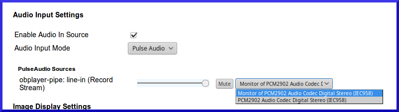
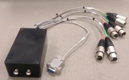
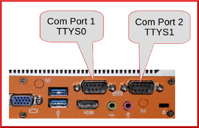
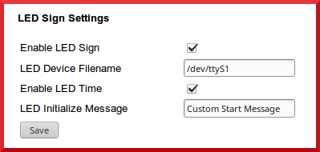
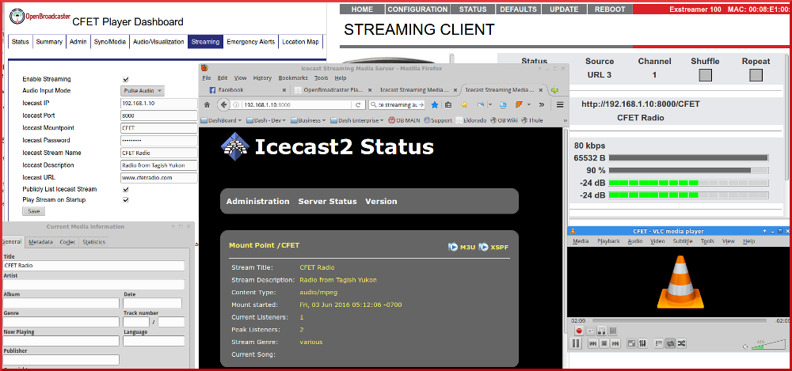

Guide for setting up external devices

* TOC
{:toc}

## Supported Hardware
{:toc}

### Audio

| Manufacturer               | Protocol         | Notes            |
| -------------------------- |------------------| -----------------|
| Allen and Heath            | USB Audio        |                  |
| Arrikis                    | USB Audio        |                  |
| AXIA\Telos                 | RTP\Livewire     |                  |
| M-Audio                    | USB Audio        |                  |
| Scarlette                  | USB Audio        |  6i6             |
| SoundCraft                 | USB Audio        |                  |
| Stellar Labs\USB XLR       | USB Audio        | PCM2902 chipset  |

### Video

| Manufacturer     | Protocol      | Notes |
| ---------------- |---------------| ------|
| Black Magic      | HDMI          |       |
| CISCO DCM        | MPEG-TS       |       |

Please [Report](mailto:support@openbroadcaster.com) successful manufacturers of hardware devices that are not listed 

## USB XLR adapter
{:toc}

__NB: Line level input signal (+4dBu) will require attenuation by -15db to -20dB.__ 

{: .usb-xlr}

The __USB XLR Adapter__ uses the Texas Instrument PCM2902 chipset, detailed specifications for which may be found [here](http://www.ti.com/lit/ds/symlink/pcm2902.pdf). 

600 ohm in-line XLR attenuators (-20dB) are recommended for installation in +4dBu radio broadcast chain. 

When the [USB to XLR cable](https://openbroadcaster.com/xlr-cable) is connected, both input and output may be routed through balanced XLR connectors.  When using the inputs on the adapter for audio bypass, source programming is muted during playback of alert messages. After the message completes, source programming resumes. 

To use the XLR cable with the Alert Player:

### Connect the cables
{:toc}

  1. Connect the __USB__ end to any one of the USB ports on the Player unit. The adapter MUST be connected before_power up for the system to auto-configure the adapter. 
  1. Connect the __male XLR__ output connectors to the inputs of your sound board, transmitter or switching relay.
  1. Connect the __female XLR__ input connectors to the output of your audio source. Use in-line attenuators (-20dB) on the inputs if connecting to +4dBu line level audio sources.
 
### Configure Audio
{:toc}

   * On the __Outputs__ Tab, set audio output mode to PULSE. Disable the *Test Signal*   From __Sources__Tab enable the __Audio In Source__ setting audio mode to PULSE.

   * If using the GPIO switching Relay, connect a serial cable from the Player to the Switching Relay. On the Emergency Alerts tab, under Advanced Settings, enable the RS-232 DTR Alert signal. The RS-232 Device Filename should be set to the serial port (/dev/ttyS0 for Port 1, /dev/ttyS1 for Port 2).

     __When audio mode settings are changed, reboot.__ Once rebooted, audio slider controls will be present in the dashboard under PULSE to set input and output levels.

{: .Input}

### Restart the Player
{:toc}

If no audio output is heard, refer to [Troubleshooting](https://support.openbroadcaster.com/troubleshooting ).

### Improving Sound Quality
{:toc}

When using USB sound cards, there are three aspects of the audio signal quality that must be addressed. To achieve the best possible sound quality, each of these limitations must be addressed in the configuration:

### Signal Attenuation
{:.no_toc}

The USB-XLR adapter is designed for input at -10dBv (0.316V, or 316 mV). Transmitter feed signals are typically +4Bu (1.228V).
The difference, in dB, between +4 dBu and -10 dBv is -11.78 dB, or about -12 dB. Therefore, between 10dB and 20 dB of attenuation is recommended to avoid distortion of +4dBv input signals. 

In-line attenuators are available [Here](https://openbroadcaster.com/catalog/).
 
{: .xlrpad} 

Instructions for DIY "H" or "T" pads may be found on the [DIY-Broadcast](https://support.openbroadcaster.com/diy-broadcast).

### Signal Phase
{:.no_toc}

The INPUTS on the USB-XLR adapter are wired are out of phase, causing a muffled or variable output signal. The photo below shows the wires in the original configuration. To fix, you will need to swap wires to pins 2 and 3 (i.e the red and white wires) in ONLY ONE of the female XLRs. This will require solder and a soldering iron. After swapping, the white wire would be connected to Pin 2, and the red wire to Pin 3. 

{: .xlr}    {: .pins}

### Signal Delay
{:.no_toc}

The USB-XLR adaptor introduces a signal delay of ~ 0.5 sec. To overcome latency delay, it is necessary to use a switching relay that interrupts the source signal to inject an Alert Message. 

## Mechanical RS232 GPIO Trigger Switching Relay
{:toc}

GPIO Trigger with RS-232 DTR on CAP-CP Alerts. When enabled and a matching CAP message is broadcast, an alert cycle starts, the serial port will be opened and the DTR line will be set. After the alert cycle has completed, the DTR line will be cleared and a relay will be closed. In the event of power failure continues to pass thru the source signal (however, relays require power to be able to switch to the Alert feed).

"Lead-In Delay (in seconds)". This is the number of seconds of silence that will be inserted at the beginning of each alert cycle before the first alert starts playing, but after the DTR/icecast stream notifies that an alert cycle has started. The default is 1 second. Always leave it at 1 or greater. Setting this to 5 or so seconds will give time for buffering to occur.

"Trigger RS-232 DTR on Alerts" checkbox, when checked, will show the "RS-232 Device Filename" option. The device filename should be something like /dev/ttyS0, or /dev/ttyUSB0 if using a USB-to-Serial adapter. For initial setup, disable all RS-232 ports so there is only one available.

The "Trigger Icecast Stream on Alerts" setting will start and stop the icecast streamer module (in the streaming tab) the same as the serial port. In addition to this setting, you must also uncheck the "Play Stream on Startup" option on the streaming tab, or else the streamer will start playing when obplayer starts.

{: .usb-xlr} 

__Prerequisites__

Update Alert Player. Com Port(s) are enabled in BIOS (default=on) 

### Install Relay
{:toc}

{: .Ports}

Connect DB9 connector (female) to Com Port 1 (ttyS0) on the back (left) of player.

1. Connect XLR `Audio Program Feed` to studio out or source material 

2. `EAS Switched Output` to main output to STL and transmitter. Audio should normally pass through, unaltered.

3. Connect EAS audio output from player into the XLR Female marked `EAS Alert Feed` using Male XLR-USB cable or onboard audio 1/8" mini jack.

Energize Power Supply

__Configure DashBoard__

Changes required for default settings.

1. __Audio Source>__ Uncheck `Enable Audio In Source`

2. __Emergency Alerts>Advanced Settings__ Enable `Trigger RS-232 DTR on Alert signal` RS-232 Device should be set to serial port (/dev/ttyS0 for Port 1, /dev/ttyS1 for Port 2).

__Testing__

Inject test alert, mechanical relay will engage when alert plays and resume normal pass through when complete.

## LED Scrolling Sign
{:toc}

__Prerequisites__

Update alert player.   Com Port(s) are enabled in BIOS (default=on)

### Install LED Screen
{:toc}

1. Connect `DB9 Female to RJ12` connector to Com Port2 (ttyS1) on the back (right) of player.

2. Plug RJ12 cable into adaptor and into LED Sign

3. __Sources Tab>__ Check Enable LED Screen

4. Plug in AC power to sign.  Start up message will scroll.

{: .LED}

__To Test__ 

Inject test alert.  CAP test message text will scroll across LED screen.

## Barix Exstreamer (Receiver)
{:toc}

Setup Static IP for Barix device. Use info that was setup in network, include DNS info

Save, Restart and login to new Static IP

Change password and set in Security (Defaults user = admin)

Test and save password in browser

### Configuration> Advanced Settings
{:toc}
Stream 1 Reserved for Priority Stream

Stream 2 //192.168.123.10:8000/CALLSIGN_LIVE  (supplied from Instreamer in field)

Stream 3 //192.168.123.10:8000/CALLSIGN  (suppplied from OBPlayer at studio)

Audio 80%

No Autoplay or USB

Disable Use SonicIP (don't want IP spoken over air every reboot)

## OBPlayer ICEcast mountpoint
{:toc}

Create an encoded MP3 stream received by a Barix Exstreamer device hooked to transmitter.  This combination creates a robust STL (Studio Transmitter Link)

From __Streaming Tab__ in dashboard create mount point
 
Enable __Streaming__ Save. Restart.

Mount point will show up in [//localhost:8000]

{: .BARIX} 
