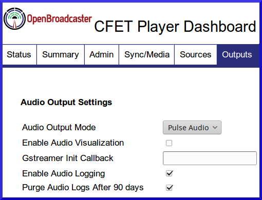
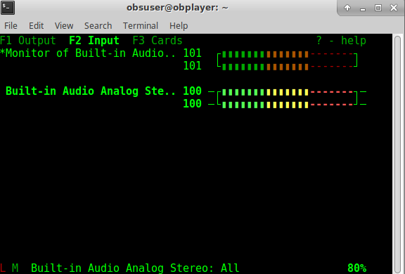

Advanced Operations

* TOC
{:toc}

### Injecting Alerts into the broadcast chain

Every station is setup different with several ways to inject audio and visual alerts into the broadcast chain.  CAP-CP alerts may be issued 
from the standalone alert player and put into the broadcast chain each with their own merits.
 
#### Audio

When an alert is received, audio is sent out for your systems to receive in several ways. Generally there is no audio present unless a message is being issued; either a valid Pelmorex CAP message, Pelmorex test message or when a internal test alert is issued.

• Onboard analog stereo 1/8” mini output using Realtek ALC888S codec.  Audio present only when a valid CAP message is being broadcast.

• GPIO trigger reverses DTR voltage on pin 4 using RS232 DB9 when CAP message is played to switch an [External relay](http://support.openbroadcaster.com/Accessories#mechanical-rs232-switching-relay).

• Using [BARIX exstreamer](http://support.openbroadcaster.com/Accessories#cap-alerts-with-barix-exstreamer) at transmitter to listen to a prioity port of incoming stream of CAP message

• Configuring ICECAST server to detect new mount point of on demand stream

• Silence Detection using external third party hardware used to sense audio coming out of the Alert Player and mechanically switch a relay on your board.

• Windows playout machine may use free Silence Detection software from [Pira CZ Silence Detector](http://pira.cz/show.asp?art=silence) to switch broadcast audio source when CAP message is played.

• Intergrating to AXIA Digital AOIP Consoles to sense an on demand Livewire stream of CAP message in conjunction with the Qor's GPIO to switch channels on the console while EAS is in progress and switch back.

#### Visual

Applicable for; over the air TV, Cable TV and digital signage applications.  Normal visual content will be displayed.  When there is a valid CAP alert, a red scrolling overlay will display the text of this message with accompanying audio of the alert. 

• Onboard local video with (HDMI\DSUB) where an overlay will be displayed when a valid CAP message is being broadcast.

• GPIO trigger on pin 4 using RS232 DB9 when CAP message is played to switch CATV channel on digital cable head end.

• Configuring ICECAST server to detect new mount point of on demand stream

### Reimaging the Player

To restore the original factory configuration, obtain the disk image for your Player from your [Open Broadcaster Downloads] (https://openbroadcaster.com/account/user-downloads) user account.

1. Use [Etcher](https://www.balena.io/etcher/) or similar utility to create a bootable USB drive (min. 4Gb) from the disk image. 
1. Insert the USB drive into the OBPlayer, and  power up the unit. The imaging process will start auotmatically. A progress bar will display. Be patient at 88% for a few minutes, it really is copying data. Observe activity on USB boot device.

1. When the process has completed, remove the USB drive and reboot.

### Recording FM Transmission
{:toc}

Most radio stations have a requirement from regulators to maintain off air recordings.  An easy way to accomplish this is the use the audio playlog feature of Player

Alert Player users are able to record and capture off-air audio logs that can be used for CRTC logging purposes or reused as a podcast. An example would be to use the onboard "line-in" of sound card, plug a FM tuner monitoring you stations signal. Pulse must be the audio mode for your system. 

1) Enable Audio Logging from the sources tab. 

{: .audio_logging} 

2) Select Input source to record.

{: .input_source} 

3) Tell Gstreamer what Source to record from. Go to command line of local box and type `pulsemixer` Select the Input source, press enter to select as default.

{: .pulse_mixer}

Audio logs will be automatically created in one hour segments. To access these audio files, click the `Downloads` button on the Status tab from the player's dashboard.

### Monitoring FM Transmission
{:toc}

An inexpensive FM signal monitoring solution can be acheived using SDR (software defined radio) and a DVB-T USB Tuner based on the Realtek RTL2832U chip. Some [clever reverse-engineering](http://rtlsdr.org/#history_and_discovery_of_rtlsdr) exposed the capability of these dongles as FM receivers. 

The example below uses a software defined radio (SDR) receiver and a [NooElec NESDR Nano RTL2832U receiver](https://openbroadcaster.com/broadcast-hardware).

When enabled in the OBPlayer dashboard, FM reception may be streamed over TCP to allow remote monitoring of the broadcast signal. An embedded FM Monitoring mountpoint displays in dashboard.

You should now be able to use SDR to remotely monitor the stream over the network

Insert USB Dongle and attach an external FM antennae

Enable FM Monitoring and restart OBPlayer dashboard.

You will now be able to select and tune to a frequency with drop down menu.

Enable recording and one hour off air logs will be available in Downloads
