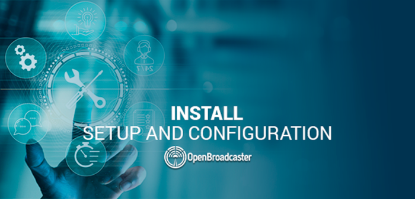

## Installation
{:.no_toc}

* TOC
{:toc}

## BEFORE YOU BEGIN
{:.no_toc}

This guide will assist in the initial setup of both OBPlayer and OBServer backend application infrastructure. Once these applications are setup and running, proceed to the [Quick Start](https://support.openbroadcaster.com/quick-start/) for provisioning instructions.

### Minimum System Requirements
{:toc}

#### OBServer

Item 	  |    Description
------------ | -------------
Processor | 1GHz 64 bit CPU. ARM, Intel or Pi 
Memory | 4GB of RAM
Storage | 128GB 
Display |	No display is required for the web server
Framework |	PHP, MySQL, Nginx and Gstreamer 

Recommended. Should be a \*nix system. Debian 10+, Raspberry PI OS or Ubuntu-Server/ Desktop 22.04/24.04 

#### OBPlayer

Item 	  |    Description
------------ | -------------
Processor |	1GHz 64 bit CPU. ARM, Intel or Pi 
Memory |	4GB RAM
Storage |	128GB 
Display |	None required unless displaying Video or Images
Audio |	Analog Input\Output, USB Interfaces or Digital HDMI\DisplayPort
Video |	Minimum 640x480 screen resolution
Framework |	Python and Gstreamer 

Recommended. Should be a \*nix system. Debian 10+, Raspberry PI OS or Ubuntu-Server/ Desktop 22.04/24.04

[Compatible Hardware](https://support.openbroadcaster.com/accessories#supported-hardware) 

[ALSA Supported Soundcards](https://www.alsa-project.org/main/index.php/Matrix:Main)

### 1. Install OBServer
{:toc}

OpenBroadcaster - Server Installation Instructions
    
Dependencies

    A web server with a web environment available (e.g., Apache, Nginx)
    PHP 8.2 or higher
    MySQL or MariaDB database server
    Composer (PHP dependency manager)
    Node.js and npm (Node Package Manager)

Required PHP Modules

Make sure the following PHP modules are installed and enabled:

    mysql (for MySQL database connectivity)
    mbstring (for multi-byte string handling)
    xml (for XML parsing)
    gd (for image manipulation)
    curl (for making HTTP requests)
    imagick (for advanced image processing)

Required Packages

Install the following Ubuntu / Debian packages, or the equivalent for your operating system.

    festival (for text-to-speech functionality)
    imagemagick (for image manipulation)
    ffmpeg (for audio/video processing)
    libavcodec-extra (extra codecs for ffmpeg)
    libavfilter-extra (extra filters for ffmpeg)
    vorbis-tools (for Ogg Vorbis audio encoding)

Installation Steps

Copy the OpenBroadcaster Server files to your web server's document root directory.

Navigate to the cloned repository directory within the web document root and run the following command to install PHP and JavaScript dependencies.

~~~~
composer install && npm install
~~~~

Create a new MySQL or MariaDB database for OpenBroadcaster and import the db/clean.sql file to set up the initial database structure.

Copy the config.sample.php file to config.php and open it in a text editor. Set the required configuration items, such as database connection details and other settings specific to your environment.

Run the following command to validate your configuration file. Correct any errors displayed in red.

~~~~
tools/cli/ob check
~~~~

Run the following command to install database updates. This may take a few minutes to complete.
    
~~~~
tools/cli/ob updates run all
~~~~

Set the password for the default admin user by running the following command. Enter a secure password when prompted.

~~~~
tools/cli/ob passwd admin
~~~~

Set up a cron job to run the cron.php script regularly. This script is responsible for clearing old cache and unused upload files. The following is an example crontab entry.

~~~~
*/30 * * * * /path/to/openbroadcaster/tools/cli/ob cron run
~~~~

_Source:_ [Install.txt](https://github.com/openbroadcaster/observer/blob/v5.3.3/INSTALL.md)

#### Web Updates
{:toc}

#### Command Line Tool
{:toc}

CLI Running Updates

{: .cli install check} 

CLI Check without errors

CHECK FOR [UPDATES](#update) Prior to reporting issues to ensure the most current version is running

#### Advanced Configuration
{:toc}

[Toubleshooting Guide](https://support.openbroadcaster.com/troubleshooting#post-installation-observer-troubleshooting)

__Web Server__

Assuming your DNS is configured, you should be able adjust ob.apache.conf to your system and copy it to the appropriate spot for your machine, restart apache, and browse to //Your_IP/ to access your server. Login in with username admin and the password you set for the Admin user. 

### 2. Install OBPlayer
{:toc}

    OBPlayer Installation Instructions

    1. See dependencies.txt for player dependencies (Debian 10/Ubuntu 20.04 & above)

    2. Run "bash obplayer_check" or "bash obplayer_loop" or "bash obplayer_check -h" for help

    3. Config files settings.db generated on first run in ~/.openbroadcaster

    4. Admin panel http://<IP_of_Player>:23233 default user = admin default password = admin

    5. Configure tabbed menus

    6. Restart the player

    NOTE:User required to change login passwords on first login using the defaults.

    Connect RJ45 to a network with a router handing out DHCP IP addresses.
    
    For advanced instructions see https://support.openbroadcaster.com/install
    
_Source:_ [install.txt](https://github.com/openbroadcaster/obplayer/blob/main/install.txt)

#### Dependencies
{:toc}

~~~~
ntp python3 python3-pycurl python3-openssl python3-apsw python3-magic python3-dateutil python3-requests python3-gi python3-gi-cairo gir1.2-gtk-3.0 gir1.2-gdkpixbuf-2.0 gir1.2-pango-1.0 python3-gst-1.0 gir1.2-gstreamer-1.0 gir1.2-gst-plugins-base-1.0 gir1.2-gst-rtsp-server-1.0 gstreamer1.0-tools gstreamer1.0-libav gstreamer1.0-alsa gstreamer1.0-pulseaudio gstreamer1.0-plugins-base gstreamer1.0-plugins-good gstreamer1.0-plugins-bad gstreamer1.0-plugins-ugly ffmpeg
~~~~

__Ubuntu__

~~~~
ubuntu-restricted-addons ubuntu-restricted-extras 
~~~~

__Extras__ _(not installed with Apt)_

Needed for SSL dashboard

~~~~
pip3 install passlib[bcrypt] 
~~~~

Needed in case it wasn't installed with Apt

~~~~
pip3 install apsw
~~~~

__Recommended for CATV Video Playout__

~~~~
gstreamer1.0-vaapi mesa-vdpau-drivers
~~~~

__CAP Alerting onboard TTS__

~~~~
espeak mbrola mbrola-en1 mbrola-us1 mbrola-us2 mbrola-us3 mbrola-fr1 mbrola-fr4
~~~~

__POLLY AWS Voices in the alerts module__

~~~~
pip3 install boto3 
~~~~

__RS-232 trigger option in the alerts module__

~~~~
python3-serial
~~~~

__Sharing multiple OBPlayers with a local media library__

~~~~
cifs-utils
~~~~

Better

~~~~
autofs
~~~~

__Command Line tool for PulseAudio__

~~~
pip3 install pulsectl         
~~~~

__Off-air audio log and SDR FM Receiver USB Dongle__

~~~~
pip3 install pyrtlsdr         
~~~~

__Include if using the news feed override__

~~~~
pip3 install inotify
~~~~ 

__Note:__ pip3 pkg not included in apt-get; must be installed using pip3

#### Web Updates
{:toc}

__NOTE__ _Utilities for displaying current version and updating the Player are on the Admin Page of the [Dashboard](#dash)._

Updating the software ensures the most current version of the application is running. To obtain and install updates, click the Update button in the dashboard Admin menu. After updating the Player, restart the Player to the load changes to the Dashboard.

{: .obplayer updates} 

Player is up to date

#### Advanced Configuration
{:toc}

[Toubleshooting Guide](https://support.openbroadcaster.com/troubleshooting#post-installation-obplayer-troubleshooting)

__Example Installation__

Open Terminal and from your home directory run:

~~~~
mkdir /usr/share/obplayer
~~~~

Then go to this directory

~~~~
cd /usr/share/obplayer
~~~~

In the empty target/installation directory run

~~~~
sudo git clone https://github.com/openbroadcaster/obplayer.git ./
~~~~

_Defaults to Main Branch_

__Change Branch during install__

~~~~
sudo git clone -b develop https://github.com/openbroadcaster/obplayer.git ./
~~~~

_Example using -b (develop branch)_

__2FA (2 Factor Authentication)__

You'll need to have a key setup on target machine and run

~~~~
git clone git@github.com:openbroadcaster/obplayer.git 
~~~~~

or

~~~~
git clone -b develop git@github.com:openbroadcaster/obplayer.git
~~~~

OBPlayer is now setup with latest code ready to use

## Running OBPlayer for first time

From the install directory __EG__ `/usr/share/obplayer`

~~~~
bash obplayer_check
~~~~

or

~~~~
bash obplayer_loop -d
~~~~

_using -d (debug) displays useful start up info_ 

__TechTip__ Resetting Lost or Admin passwords cannot be retrieved easily. Config files containing user and machine settings are located in the hidden ~/.openbroadcaster folder within the users home directory.  To reset admin or lost passwords may be recovered by editing the sqlite DB file `settings.db` or simply deleting it and restarting obplayer. On restart obplayer will recreate this DB with default values and prompts for new passwords.
{: .alert .alert-info}
