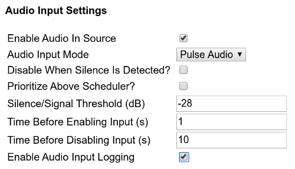

Advanced Operations

* TOC
{:toc}

## PlayLogs

Generated with server [Player Monitoring](http://support.openbroadcaster.com/server/#logging-and-monitoring) or the [Reports](http://support.openbroadcaster.com/reports/) module.

## Audio Logging

{: .audio_logging} 

Enable `Audio Logging` from the sources tab. 

Audio logs will be automatically created in one hour segments. To access these audio files, click the `Downloads` button on the Status tab from the player's dashboard that are located in ./openbroadcaster/Audio-Logs

 

### Silence Detection Recording

{: .input_source} 

Automatic Audio Input Recording adjusting the sensitivity of present signals from Line In source

 

## Recording FM Transmission

Most radio stations have a requirement from regulators to maintain off air recordings.  An easy way to accomplish this is the use the Audio Logging feature of Player

Users are able to record and capture off-air audio logs that can be used for CRTC logging purposes or reused as a podcast, several ways

### Onboard Line in ###

{: .input_source} 

Use the onboard "line-in" of sound card, plug an analog FM tuner, monitoring your stations signal. 

__Pulse must be the audio mode for your system.__

Select Input source to record displaying USB XLR device

 

## Recording Over the Air FM Transmission

An inexpensive FM signal monitoring solution can be acheived using SDR (software defined radio) and a DVB-T USB Tuner based on the Realtek RTL2832U chip. Some [clever reverse-engineering](http://rtlsdr.org/#history_and_discovery_of_rtlsdr) exposed the capability of these dongles as FM receivers. 

The example below uses a  [NooElec NESDR Nano RTL2832U receiver](https://openbroadcaster.com/broadcast-hardware) USB Stick software defined radio (SDR) receiver.

- Insert USB Dongle and attach an external FM antennae

- Enable `SDR Recording` and restart OBPlayer dashboard.

- Select and tune to a frequency with drop down menu.

- SDR source is remotely recording and streamed over the network. 

One hour off air recordings are available in `Dashboard>Downloads` or `./openbroadcaster/off-air-recordings`

### Monitoring Over the Air Monitoring FM Transmission

When SDR radio is enabled, a local mount point is created in dashboard media player and local icecast server.

### Pulse Mixer

{: .pulse_mixer}

__Pro Tip__ Gstreamer Source to record. Go to command line of local box and type `pulsemixer` Select the Input source, press enter to select as default.

