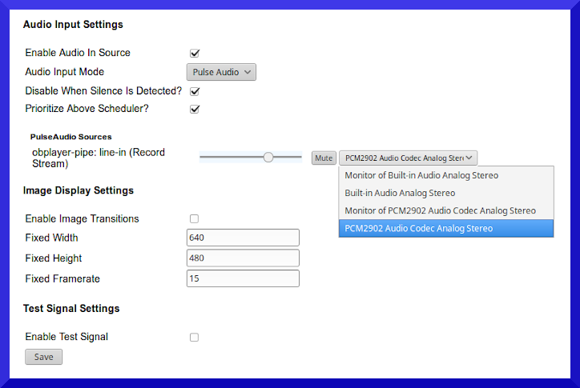

# Troubleshooting #
{:.no_toc}

* TOC
{:toc}

## Post Installation OBServer Troubleshooting ##

New process for updates with CLI Tool >5.3
{: .alert .alert-info}

After install, run CLI Tool

    obsuser@observer:/var/www/observer$ tools/cli/ob 
    OpenBroadcaster CLI Tool (alpha). Run ob <command>.

    Commands:
    check                 check installation for errors                             
    cron run              run scheduled tasks                                       
    updates list          list available updates                                    
    updates run           run available updates                                     
    passwd <username>     change password for user         

### Resetting Lost Password

Use CLI tool 

~~~~
/var/www/observer/tools/cli/ob passwd <username> 
~~~~

**Legacy Updates pre 5.3**

After install, log in as user `updates` privileges and Run updates with GUI tool.

~~~~
    http://Your_Server_IP/updates 
~~~~

Fix for OB Sites in config by adding a FQDN (Fully Qualified Domain Name) 

~~~~
    nano /etc/hosts 
~~~~

"This file format is not supported" and "Cannot upload media"

Make sure format is enabled `>Admin>Media Settings`

~~~~
    ln -s /usr/bin/ffmpeg /usr/local/bin/avconv

    ln -s /usr/bin/ffprobe /usr/local/bin/avprobe
~~~~

## Post Installation OBPlayer Troubleshooting ##

### Startup 

Open local `Terminal` or ssh into target machine. Cd to dir where player files are installed eg `/usr/share/obplayer`

__Do not run as root or Sudo__

Script `bash obplayer_check` starts the player and checks for existing instances and not start if already running

Script `bash obplayer_loop` runs in an infinite loop to restart in case it unexpectedly terminates (crashes) or is shutdown via the web dashboard

Add these switches for extra functionality

`obplayer -d` Prints log messages to stdout console

`obplayer -f or --fullscreen` Starts GTK full screen on startup

`obplayer -H` Starts headless, no desktop GUI (audio only)

`obplayer -m` Starts screen minimized

`obplayer -r` Restart 

Clears out Playlist\Schedule\Media\Priority broadcast cache

`obplayer  -c CONFIGDIR, --configdir` Specifies an alternate data directory 

(default: ['~/.openbroadcaster'])

`obplayer -- disable-updater`   Disables the OS updater

`obplayer -- disable-http`  Disables the http admin dashboard

### Networking

On headless machines OBPlayer is accessed from a web dasboard accessible from another machine on the same network from an IP address that is issued with DHCP.  To determine the local IP of Player from terminal issue `ip addr show`  Your IP will appear like 192.168.1.100.  127.0.0.1 is a local loop back IP internal to your machine. You might also get into your router and look at the DHCP Client list and see the players IP that way.  

**Recomended that OBPlayers be setup with a static IP address as DHCP can often change.**

From a web browser type 

~~~~
http://ip-of-server:23233
~~~~

Login window will prompt for user and password. If there is a timeout and/or network unreachable message try these steps to resolve.

__Networking Tests__

From __Terminal__ Ping "localhost" replies indicate internal networking working

From __Terminal__ Ping "IP-of_Router/Gateway" replies indicate networking working to router.

From __Terminal__ Ping "IP-of-Other-Device-on-Network" replies indicate OBPlayer and router are able to communicate to other Devices.

From __Terminal__ Ping "google.com" replies indicate network is able to communicate through router to the real world internet.

### Checking Player is running

If you are unable to access the player dashboard, do not have local access or running in a virtual service, you'll want to verify OBPlayer appears as a process.

From __Terminal__ 

~~~~
ps -ef | grep python
~~~~

Lists all Python process including OBPlayer.  If this is not showing then OBPlayer is not running.

{: .psfax-python}

To check all running processes, including OBPlayer and Icecast 

~~~~
ps fax
~~~~ 

In this example both OBPlayer and Icecast are highlighted

{: .psfax}

### Sync

Ensure OBPlayer device is able to access the internet.  

From the local machine, open a Terminal and "ping google.com" to reach the management server as specified in sync settings under the Sync tab. 

The format of the sync url can be "localhost/remote.php", "127.0.0.1/remote.php" or http(s)://IP-of-Server/remote.php" Do not forget to include the trailing `/remote.php`
{: .alert .alert-info}

Check the sync url exisits by pasting into browser and you should see screen asking for Device Id.  This isn't accesible or do anything, but you can verify the server is expecting a sync for that ID

{: .sync-connect}

Confirm/Re-enter passwords and Device to match player in >Player Manager in the OBServer 

From >Admin Tab `Restart DB and Reset` forces a reset of a fresh sync of media and schedules

### Resetting Lost Password

Files containing user and machine settings are located in the hidden `.openbroadcaster` folder within the users home directory. The __Admin Tab__ provides utilities for backup and restoration of user settings.  To reset admin or lost passwords may be recovered by editing the sqlite DB file  __settings.db__  or simply deleting it and restarting obplayer.  On restart obplayer will recreate this DB with default values.

__data.db__ contains a copy of media and schedule for the period identified by the sync buffer (default 24 hours). From OBPlayer dashboard >Admin `Delete data.db and Restart` to purge db forces a refresh of schedules and media according to the current sync settings. Useful when changing backend services.

## Audio Settings
{:.toc}

[Pulse](#pulse) is the default tool for adjustment of output levels for all installed sound cards in Ver 5.X Series OBPlayers and will produce sound quality suitable for broadcast. 

Addional supported audio modes:

• ALSA

• Esound  

• OSS

• JACK   

Set to `No Input` to disable on board audio play back.

Setting __Audio Mode__ and restarting will bring up a visual slider control to set levels for both input and output in dashboard to control signal levels 

### Audio Test Signal 

Use the __test signal__ to confirm your audio setup is working correctly.

To test the __on-board__ sound card:

1. Disconnect all external USB adapter.
1. Connect headphones or studio monitor to onboard audio output.
1. On the [Outputs](#Outputs) Tab, Select __Audio Mode__ PULSE. Enable Test Signal.
1. On the [Sources](#Sources) Tab disable Audio In Source
1. Save changes & restart OBPlayer 
1. Test Signal (440 Hz tone) should be audible with levels present on VU meter.

To test an external __USB__ sound card with XLR balanced audio output:

1. Connect [supported](https://support.openbroadcaster.com/accessories#supported-hardware) USB adapter.
1. Connect the XLR outputs to sound board, amp or studio monitors.
1. On the [Outputs](#Outputs) Tab, Select __Audio Mode__ PULSE. Enable Test Signal.
1. On the [Sources](#Sources) Tab disable Audio In Source
1. Save changes & restart OBPlayer 
1. The Test Signal (440 Hz tone) should be audible. 

If no audio output is produced, check the Status page for errors in the log and observe VU meter for activity:

1. Be sure `audio mode` is properly configured.
1. There are `gstreamer` errors indicating problems with audio mode settings. 
1. Adjust slider control or adjust from CLI `pulsemixer`
1. No PulseAudio Sources Present in dashboard press F5 to refresh browser.

Disable the test signal once audio setup is working. Enable __Audio In Source__, if necessary.

 

### Adjusting Audio Levels 

{:toc}

### Pulse Audio
{:.no_toc}

Pulse is the default and recommended audio system to use with OBPlayer. When audio mode settings are changed, __Reboot.__ Once rebooted, audio slider controls will be present in the dashboard under PULSE to set input and output levels. 

* On the __Outputs__ Tab, set audio output mode to PULSE. Disable the *Test Signal*   From `Sources Tab` enable the `Audio In Source` setting audio mode to "PULSE".

* If using the GPIO switching Relay, connect a serial cable from the Player to the Switching Relay. On the Emergency Alerts tab, under Advanced Settings, enable the RS-232 DTR Alert signal. The RS-232 Device Filename should be set to the serial port (/dev/ttyS0 for Port 1, /dev/ttyS1 for Port 2).

{: .Input}

### Recording with silence detection

When enabled, will automatically record only if signal present on line in

{: .Silence Detection}

### Jack Audio
{:.no_toc}

There are no input level GUI controls "out-of-the-box" with Jack audio, so if further control over the input level is desired, the configuration must be updated to include jack-mixer. Using jack-mixer programs requires a modified __jack.plumbing__ configuration with connections defined between the OpenBroadcaster ports, the jack-mixer control and system output. 

- If using Jack, check that the file `~/.jack.plumbing` ( or `/etc/jack.plumbing`) contains the correct connection definitions.
- If using Pulse, check the file `~/.pulse/client.conf` is set to enable Pulse to autospawn.
Create a new configuration file called .jack.plumbing in the home directory (make sure it has the preceeding dot). This will override the system defaults.

~~~~
obsuser@obsource:~$ `nano ~/.jack.plumbing`
#connect Audio Inputs to OpenBroadcaster Inputs
(connect "system:capture_1" "openbroadcasterin:in_audiosrc_1")
(connect "system:capture_2" "openbroadcasterin:in_audiosrc_2")

#Connect Openbroadcaster Outputs to Audio Outputs
(disconnect "openbroadcasterout:out_audiosink_1" "system:playback_1")
(disconnect "openbroadcasterout:out_audiosink_2" "system:playback_2")
(connect "openbroadcasterout:out_audiosink_1" "jack_mixer:OB_In L")
(connect "openbroadcasterout:out_audiosink_2" "jack_mixer:OB_In R")
(connect "jack_mixer:OB_In Out L" "system:playback_1")
(connect "jack_mixer:OB_In Out R" "system:playback_2")
~~~~

{: .jack}

If Jack is already running, it will load the new configuration. Open the jack-mixer this will open a mixer control, with an input channel on the left and Main output channel is on the right. The sliding control for the input channel can be used to set the level for the line-in (input) signal. 

If Jack is not running ensure it is configured in the Dashboard, and reboot the Player, and open the jack-mixer control from desktop.

__EG__ When using jack mixer, the jack-mixer control must be opened manually from the Panel Icon to activate the control. Once the control is closed, the output will stop playing. The control must be visible and indicating signal bars for output signal to be audible. The mixer control must be reopened after a reboot, or no sound will be produced. 

 
To open the jack mixer control in headless mode), use the command:

 `jack_mixer -c ~/.openbroadcaster/init_mix_vol --no-lash`.

__To restore the original configuration of jack.plumbing, without the jack-mixer control, edit ~/.jack.plumbing file to define the following connections:__

~~~~
   #obsuser@obsource:~$ nano ~/.jack.plumbing

   #connect Audio Inputs to OpenBroadcaster Inputs
   (connect "system:capture_1" "openbroadcasterin:in_audiosrc_1")
   (connect "system:capture_2" "openbroadcasterin:in_audiosrc_2")
   
   #Connect Openbroadcaster Outputs to Audio Outputs
   (connect "openbroadcasterout:out_audiosink_1" "system:playback_1")
   (connect "openbroadcasterout:out_audiosink_2" "system:playback_2")
~~~~

## Video Settings

Select video system in drop down menu in `>Sources>Video`  Restart OBPlayer dashboard.   When the new video system is enabled, it will automatically detect the video capabilities of the onboard detected video processing.

## Reimaging the Player/Server
{:.no_toc}

To restore the original factory configuration, obtain the disk image for your supported Player/Server from your [OpenBroadcaster Downloads] (https://openbroadcaster.com/store) Contact us for access.

1. Use [Etcher](https://www.balena.io/etcher/) or similar utility to create a bootable USB drive (min. 8Gb) from the disk image.

1. Insert the USB drive into the OBPlayer, and  power up the unit. The imaging process will start auotmatically. A progress bar will display. Be patient at 88% for a few minutes, it really is copying data. Observe activity on USB boot device.

1. When the process has completed, a window will prompt to power off. Remove the USB drive and reboot.
